# Architecture

```mermaid
flowchart LR
    A["Ren'Py dialogue line"] --> B["octomil_tts.rpy"]
    B --> C["Speaker/tag voice resolver"]
    C --> D["Octomil LocalTTSPipeline"]
    D -->|cache hit| E["Ren'Py sound channel"]
    D -->|cache miss| F["Octomil Python SDK"]
    F --> G["local audio.speech.create"]
    G --> H["Native Octomil runtime dylib"]
    H --> I["sherpa-onnx Kokoro 82M"]
    I --> J["WAV output"]
    J --> K["Pipeline cache write"]
    K --> E
```

## Runtime Flow

1. Ren'Py advances to a dialogue line.
2. `octomil_tts.rpy` cleans Ren'Py markup and resolves the speaker tag/name to
   a Kokoro voice.
3. The script calls `LocalTTSPipeline.play_current(...)`.
4. On cache hit, the pipeline plays the WAV immediately.
5. On cache miss, the pipeline schedules foreground synthesis through Octomil.
6. The SDK routes local TTS to the native `tts` runtime dylib.
7. The runtime runs Kokoro through sherpa-onnx and returns WAV audio.
8. The pipeline writes the WAV and plays it only if the line is still current.
9. The script scans upcoming AST nodes and schedules speculative prefetch.

## Ownership

Octomil SDK:

- client lifecycle,
- warmup,
- generated WAV cache,
- async worker,
- foreground/speculative priority,
- stale-job pruning,
- late-result suppression.

Ren'Py integration:

- app bundle paths,
- character callback,
- text cleanup,
- voice-map lookup,
- AST lookahead,
- playback function.

App/game:

- speaker tags,
- cast map,
- cache policy,
- install/packaging choice.

## Why Native Runtime

The native runtime gives embedded apps the same path used by Octomil SDKs:

- one keyless local-first API,
- native TTS capability discovery,
- stream/create cancellation and preemption,
- shared model/runtime warmup,
- process-global Kokoro engine reuse.

## Why Cache Still Matters

Kokoro is viable after warmup for fallback generation, but a visual novel has
many known lines. The best user experience is:

- prewarm before gameplay,
- prefetch upcoming lines,
- play cached WAVs whenever possible,
- synthesize only uncached or dynamic lines live.
