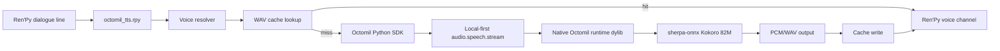

# Architecture

## Runtime Flow

1. Ren'Py advances to a dialogue line.
2. `octomil_tts.rpy` resolves the current speaker tag/name to a Kokoro voice.
3. The script computes a stable cache key from `voice + text`.
4. If a WAV exists, it plays immediately on Ren'Py's voice channel.
5. If no WAV exists, an async worker requests local TTS from the Octomil SDK.
6. The SDK routes to the native `tts` runtime dylib.
7. The runtime runs Kokoro through sherpa-onnx and streams/returns audio.
8. The script writes the WAV and plays it if the player has not advanced.

## Why Native Runtime

The native runtime gives the app the same path used by Octomil SDKs:

- one keyless local-first API,
- native TTS capability discovery,
- stream cancellation/preemption,
- shared model/runtime warmup,
- process-global Kokoro engine reuse,
- measured latency improvements in embedded hosts.

## Why Cache Still Matters

Kokoro is fast enough after warmup for fallback generation, but a visual novel
has many known lines. The best user experience is:

- prewarm before gameplay,
- prefetch upcoming lines,
- play cached WAVs whenever possible,
- synthesize only uncached or dynamic lines live.
