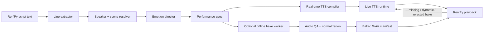

# Eternum v2 Emotional TTS

## Position

Kokoro remains v1: small, local, cacheable, and good enough for fallback or
dynamic lines. Eternum v2 should be hybrid: an emotional real-time TTS path for
dynamic/unbaked lines, plus an optional offline bake path for lines where review
and quality matter most.

The product goal is not "prebake everything." The goal is:

- preserve the existing Ren'Py integration and Kokoro cache behavior,
- add structured performance metadata per line,
- make real-time synthesis emotionally directed,
- optionally generate higher-expression reviewed takes offline,
- use the best available route without stalling gameplay.

## Pipeline



## Why Hybrid

Visual novel dialogue is mostly known ahead of time, but a good Eternum
integration still needs live generation for:

- dynamic/generated lines,
- newly added script lines that have not been baked yet,
- modded content,
- player-name substitutions,
- fallback on machines or branches without a shipped bake,
- fast iteration while tuning emotion prompts.

Offline generation still matters because it gives the team control over the
parts that reward review:

- line-by-line review,
- deterministic cache keys,
- regeneration of only bad takes,
- loudness normalization,
- per-character quality checks,
- premium quality for main-cast or high-emotion scenes.

So v2 should route each line through the cheapest path that meets the quality
and latency target, rather than forcing every line into one mode.

## Data Model

Every spoken line gets a stable line id and a performance sidecar.

```json
{
  "line_id": "eternum_ch03_0142",
  "speaker": "Luna",
  "voice_profile": "luna_v2",
  "text": "You really came back...",
  "performance": {
    "emotion": "relieved",
    "intensity": 0.58,
    "pace": "slow",
    "volume": "soft",
    "delivery": "warm, guarded, trying not to sound too hopeful",
    "pause_ms_after": {
      "back": 450
    }
  },
  "engine": {
    "realtime": "kokoro-82m",
    "preferred": "expressive-realtime",
    "offline": "expressive-offline"
  }
}
```

The sidecar stores intent, not engine-specific parameters. A separate compiler
maps intent to the selected TTS backend.

## Emotion Director

Because v2 has script text only, the emotion director should infer delivery
from:

- speaker,
- current Ren'Py label,
- previous 2-5 lines,
- inline punctuation and pauses,
- nearby narration or stage directions,
- optional manually-authored overrides.

The director should output conservative tags. It is better to mark a line
`guarded, intensity=0.35` than to overact every scene.

Suggested canonical emotions:

```text
neutral, warm, amused, teasing, embarrassed, nervous, afraid, angry,
hurt, sad, relieved, intimate, suspicious, urgent, exhausted
```

Suggested delivery dimensions:

```text
pace: very_slow | slow | normal | quick | rushed
volume: whisper | soft | normal | firm | raised
energy: low | restrained | normal | bright | intense
```

## Engine Strategy

### v2 real-time path

The real-time path should compile `performance` into backend-specific controls:

```json
{
  "input": "You really came back...",
  "voice": "af_nova",
  "speed": 0.9,
  "style": "relieved, soft, slow, guarded warmth",
  "latency_budget_ms": 1200,
  "route": "local_first"
}
```

For Kokoro, most emotional control comes from `voice`, `speed`, punctuation,
and conservative text shaping. For an expressive real-time model, the same
intent can become `exaggeration`, `cfg_weight`, `emotion_vector`,
`style_prompt`, or paralinguistic tags.

Recommended real-time tiers:

1. **Immediate cache hit**: exact prior live generation.
2. **Prefetched live generation**: upcoming line synthesized before display.
3. **Foreground live generation**: synthesize current line with a latency
   budget.
4. **Low-latency fallback**: Kokoro with reduced controls if the expressive
   model is too slow or unavailable.

### v2 optional offline worker

Use a heavier expressive TTS backend outside the Ren'Py app bundle for reviewed
lines. The worker only needs to produce WAV files and metadata. It does not need
to fit the native runtime ABI on day one.

Good candidates to test:

- Chatterbox / Chatterbox Turbo for emotion exaggeration, paralinguistic tags,
  and permissive licensing.
- IndexTTS2 for stronger explicit emotion and duration control, pending license
  review and artifact stability.
- CosyVoice-family models if multilingual or prompt-cloned voices matter more
  than simple packaging.

### Kokoro v1 fallback

Keep the existing Kokoro path for:

- missing baked files,
- dynamic text,
- real-time lines on low-end machines,
- local-only demos,
- failure recovery.

Kokoro consumes only the subset it can honor: `voice`, `speed`, punctuation, and
cache key. It should ignore unsupported emotional fields rather than pretending
to perform them.

## Voice Profiles

With script text only, there is no true cast voice cloning source. v2 needs a
voice-profile library:

```json
{
  "luna_v2": {
    "speaker": "Luna",
    "fallback_voice": "af_nova",
    "reference_prompt": "assets/voice_prompts/luna_v2.wav",
    "style": "soft, intimate, guarded warmth",
    "default_pace": "slow",
    "default_energy": "restrained"
  }
}
```

The reference prompt can come from a licensed voice actor, a synthetic voice
seed that the team owns, or an approved generated seed. Do not clone a public
voice or a game actor without permission.

If no v2 reference profile exists for a character, the bake worker should fall
back to Kokoro for that line and mark the manifest entry as fallback-generated.

## Manifest

The baked output manifest should be one playback source, not the only source.

```json
{
  "version": 2,
  "engine": "chatterbox-turbo",
  "entries": [
    {
      "line_id": "eternum_ch03_0142",
      "speaker": "Luna",
      "text_hash": "sha256:...",
      "performance_hash": "sha256:...",
      "audio": "voice/eternum_ch03_0142.wav",
      "duration_ms": 2310,
      "lufs": -18.0,
      "status": "approved"
    }
  ]
}
```

The playback lookup should prefer:

1. exact baked match: `line_id + text_hash + performance_hash`,
2. exact live-cache match with the same performance hash,
3. old approved bake with same `line_id` if text drift is explicitly allowed,
4. expressive real-time synthesis if available,
5. Kokoro v1 live/cache fallback.

## Real-Time Policy

Each packet should also carry a real-time policy:

```json
{
  "version": 1,
  "latency_budget_ms": {
    "cache_hit": 50,
    "prefetch": 250,
    "foreground": 1200,
    "fallback": 1800
  },
  "routes": [
    "baked_approved",
    "live_cache",
    "expressive_realtime",
    "kokoro_realtime"
  ],
  "fallbacks": {
    "expressive_realtime_unavailable": "kokoro_realtime",
    "foreground_budget_exceeded": "kokoro_realtime"
  }
}
```

This is the contract that keeps real-time behavior deliberate. The game should
never wait indefinitely because a prettier model is thinking.

## Cache Key

The current v1 cache key is effectively `voice + text`. v2 should include:

```text
line_id + text_hash + voice_profile + performance_hash + engine_id + engine_version + route
```

This prevents a neutral line from being reused after emotional metadata changes.

## Implementation Slices

### Slice 1: Metadata and bake manifest

- Extract Ren'Py dialogue into stable line records.
- Add sidecar performance JSON.
- Add real-time policy JSON.
- Add baked manifest lookup before current Kokoro playback, but keep live
  synthesis as fallback.
- Keep Kokoro fallback unchanged.

### Slice 2: Emotion director

- Generate initial performance specs from script context.
- Allow manual overrides by `line_id`.
- Add a review report showing high-intensity lines, unknown speakers, and
  fallback-only characters.

### Slice 3: Real-time compiler

- Compile `performance` into Kokoro controls: voice, speed, punctuation.
- Add a second compiler target for expressive real-time models.
- Enforce foreground latency budgets and route fallback.
- Add cache keys that include `performance_hash` and `route`.

### Slice 4: Expressive offline worker

- Add an offline worker that reads line records and performance specs.
- Generate WAV files with one candidate engine.
- Normalize loudness and write manifest entries.
- Support regeneration of one speaker, one label, or one line id.

### Slice 5: QA loop

- Build a small review table with text, speaker, emotion, engine, duration, and
  approval status.
- Flag outliers: too long, too short, clipping, silence, repeated output, or
  missing audio.
- Approve only reviewed or rule-passed lines for shipping.

## First Experiment

Pick 30-50 lines across five emotional states:

```text
neutral, teasing, hurt, afraid, relieved
```

Use three characters with different voice profiles. Generate:

- Kokoro v1 baseline,
- Kokoro v2 real-time compiled version,
- expressive real-time version if the candidate model can meet latency,
- expressive v2 take,
- expressive v2 take with lower intensity.

Review blind. The v2 engine only earns promotion if it is clearly better than
Kokoro on emotion without damaging character consistency, and the real-time
path only earns promotion if foreground lines stay inside budget.
